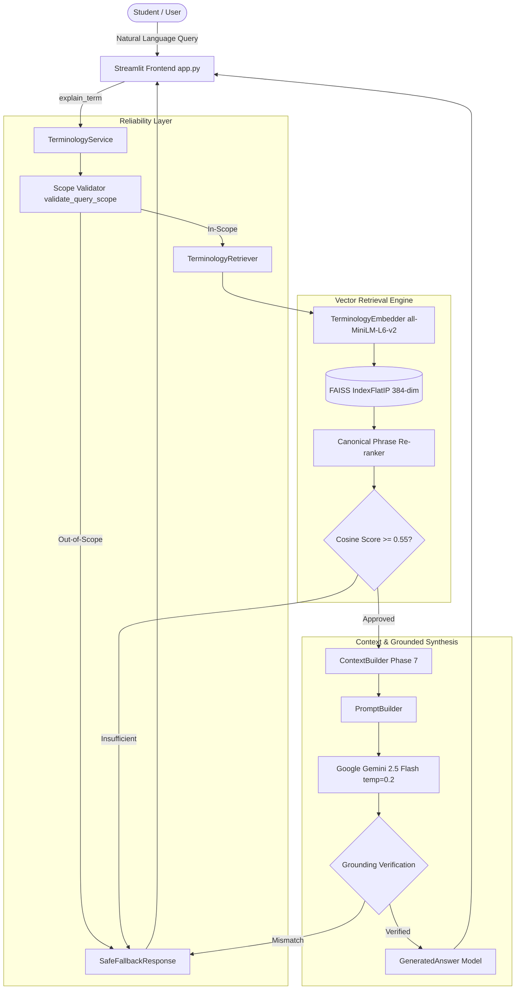

# EMP-12: Job & Skill Terminology Simplifier
## Final Academic Presentation Slide Outline (18 Slides)

---

### SLIDE 1 — TITLE
# EMP-12 — Job & Skill Terminology Simplifier
### A Contextual RAG-Based Employment Terminology Assistant

- **Student Name(s):** `[Candidate Name(s) Placeholder]`
- **Register Number(s):** `[Register / Roll Number(s) Placeholder]`
- **Department:** Department of Computer Science & Engineering / Information Technology
- **Institution:** `[College / University Name Placeholder]`
- **Faculty Guide / Supervisor:** `[Guide Name & Designation Placeholder]`
- **Academic Year:** `[2025 – 2026 Placeholder]`

---

### SLIDE 2 — PROBLEM STATEMENT
## Official Problem Statement

> **“Develop a domain-specific glossary and RAG system for employment terminology such as job roles, technical skills, professional qualifications, employment terms, and industry-specific terminology.”**

### Context & Challenge
- Beginners, students, and career changers face immense difficulty deciphering recruitment descriptions.
- Technical jargon, corporate acronyms, and contractual conditions are often defined using circular or marketing language.
- **Project Solution:** A specialized assistant delivering plain-English, contextual explanations grounded in trusted domain standards.

---

### SLIDE 3 — MOTIVATION
## The Need for Terminology Simplification

```text
Complex Workplace Jargon & Technical Terms
                   ↓
Beginner Confusion & Imposter Syndrome
                   ↓
Inability to Map Skills to Job Descriptions
                   ↓
EMP-12 Contextual Terminology Assistant
                   ↓
Plain English + Workplace Context + Grounded Factuality
```

- **Why Not General Web Search?** Generic search results return lengthy, vendor-biased documentation or conflicting blog posts.
- **Why Not Pure LLMs?** Ungrounded LLMs hallucinate non-existent tools, qualifications, and confuse role boundaries.

---

### SLIDE 4 — PROJECT OBJECTIVES
## Key Engineering Goals

1. **Curate an Authoritative Glossary:** 60 validated records across 5 employment categories.
2. **Dense Semantic Retrieval:** Dense vector indexing using SentenceTransformers and FAISS.
3. **Evidence-Grounded Generation:** Low-temperature (0.2) explanation synthesis via Google Gemini 2.5 Flash.
4. **Multi-Stage Guardrails:** Dual-scope gating, 0.55 similarity threshold, and post-generation grounding.
5. **Contextual Intelligence:** Intent classification and category-aware workplace contextualization.
6. **Accessible User Interface:** Pure-Python Streamlit frontend with difficulty badges and study card export.
7. **Empirical Quality Evaluation:** Rigorous benchmarking across 92 test cases.
8. **Measurable Performance:** Sub-millisecond warm in-memory caching.
9. **Security & Deployment Hardening:** API key isolation, 300-char input limit, and Docker containerization.

---

### SLIDE 5 — PROJECT SCOPE & TAXONOMY
## Five Approved Domain Categories (60 Records)

EMP-12 is strictly restricted to five core employment domains:

```text
1. Job Roles                   (12 Terms)  e.g., Software Developer, DevOps Engineer, Machine Learning Engineer
2. Technical Skills            (15 Terms)  e.g., Python, Docker, Git, REST API, SQL
3. Employment Terms            (12 Terms)  e.g., Full-Time, Probationary Period, Notice Period, Severance
4. Professional Qualifications (9 Terms)   e.g., AWS Certified Solutions Architect, PMP, Bachelor's Degree
5. Industry Terminology        (12 Terms)  e.g., Agile, Scrum, CI/CD, Microservices, Cloud Computing
────────────────────────────────────────────────────────────────────────────────────────────────────────
Total Approved Knowledge Base:  60 Records (41 Beginner | 16 Intermediate | 3 Advanced)
```

*Explicit Scope Exclusions: No job matching, resume builders, interview simulators, or salary predictions.*

---

### SLIDE 6 — SYSTEM ARCHITECTURE
## End-to-End System Flow



---

### SLIDE 7 — THE KNOWLEDGE BASE
## Structured Domain Terminology Data

- **Total Records:** 60 verified entries across 5 JSON files in `data/knowledge_base/`.
- **Target Difficulty Distribution:**
  - 🟢 **Beginner:** 41 terms (68.3%)
  - 🟡 **Intermediate:** 16 terms (26.7%)
  - 🔴 **Advanced:** 3 terms (5.0%)
- **Data Contract (`TerminologyRecord` Schema):**
  - Canonical Term & Category
  - Formal Definition & Simple Plain-English Meaning
  - Workplace Context & Real-World Example
  - Verified Companion Terms & Authoritative Source Citations
- **Authoritative Sources:** U.S. Bureau of Labor Statistics (BLS), O*NET OnLine, IEEE, ACM, NIST, W3C, and Python Software Foundation.

---

### SLIDE 8 — RAG PIPELINE
## Retrieval-Augmented Generation Architecture

```text
User Query: "Explain Machine Learning Engineer for beginners"
                    ↓
Normalized Dense Vector (384 Dimensions via all-MiniLM-L6-v2)
                    ↓
FAISS IndexFlatIP Cosine Similarity Search (Top-5 Chunks)
                    ↓
Canonical Phrase Re-ranking (+0.20 complete phrase boost)
                    ↓
Evidence Sufficiency Check (Top Score >= 0.5500)
                    ↓
Context Construction (Injects Job Role context & Beginner difficulty)
                    ↓
Google Gemini 2.5 Flash Synthesis (Locked Temperature: 0.2)
                    ↓
Deterministic Grounding Verification (Term, Category, Source Provenance)
                    ↓
Structured Pedagogical Answer Delivered to UI
```

**Why RAG?** RAG ensures the LLM acts purely as an educational synthesizer of retrieved project evidence rather than hallucinating from unconstrained open-domain memory.

---

### SLIDE 9 — TECHNOLOGY STACK
## Complete Implementation Ecosystem

| Technology | Role & Specification |
| :--- | :--- |
| **Python 3.14.3** | Core language runtime, asynchronous execution, and data pipelines |
| **Streamlit 1.42+** | Pure-Python reactive web application framework |
| **Pydantic 2.12+** | Schema enforcement for records, chunks, answers, and evaluations |
| **Sentence-Transformers** | `all-MiniLM-L6-v2` generating 384-dimensional dense vectors |
| **FAISS CPU** | `IndexFlatIP` performing exact inner-product similarity search |
| **Google Gemini API** | `gemini-2.5-flash` for factual structured JSON explanation synthesis |
| **PyTorch & scikit-learn** | Underlying tensor operations and evaluation metric calculations |
| **pytest 9.1+** | Test automation harness powering all 229 verification tests |

---

### SLIDE 10 — GUARDRAIL & HALLUCINATION CONTROL
## Deterministic Reliability Layer

EMP-12 rejects unsupported queries before they reach or leave the LLM:

- **Dual-Scope Gating:** Pre-retrieval scope analysis intercepts gibberish, arithmetic, and general-domain topics.
- **Cosine Relevance Threshold (`0.55`):**
  - Supported queries average **0.7026** cosine similarity (minimum 0.5836).
  - Unknown queries average **0.1603** cosine similarity (maximum 0.2851).
  - Clean **+0.2985 safety margin** above the threshold.
- **Post-Generation Grounding Validation:**
  - Verifies that generated terms and categories match the retrieved chunks.
  - Verifies that 100% of cited sources exist in the retrieved evidence.
- **Safe Fallback:** Deterministic guidance presenting the 5 official categories without stochastic LLM apologies.

*Note: The system is designed to minimize unsupported answers; no system is claimed to be universally hallucination-proof.*

---

### SLIDE 11 — CONTEXTUAL INTELLIGENCE
## Pedagogical Intent & Difficulty Calibration

- **7 Query Intents Detected:** `Definition`, `Employment Context`, `Usage`, `Role Context`, `Qualification Context`, `Industry Context`, and `Related Terms`.
- **Category-Aware Prompting:** Injects tailored situational guidance:
  - *Job Roles:* Highlights team collaboration, deliverables, and typical toolchains.
  - *Employment Terms:* Clarifies employee rights, employer expectations, and legal context.
  - *Technical Skills:* Emphasizes practical usage scenarios and companion frameworks.
- **Difficulty Adaptation:** Calibrates metaphor complexity to the term's difficulty rating (Beginner, Intermediate, Advanced).

---

### SLIDE 12 — USER INTERFACE & FEATURES
## Accessible Frontend Designed for Learners

- **Structured Educational Cards:** Term header, Category badge, Difficulty badge, Simple Meaning callout, Why It Matters, Workplace Context, Example, Sources, and Copy Card.
- **Quick-Start Chips:** One-click popular concept exploration chips.
- **Glossary Explorer:** Full-text keyword and alias search across all 60 terms with real-time category filtering.
- **Interactive Related Terms:** Clickable chips for companion terms automatically trigger grounded RAG queries.
- **Study Card Export:** Generates clean Markdown text for student note-taking, omitting system diagnostics.
- **Instant Reset Control:** Resets search fields and active answer cards in a single click.

---

### SLIDE 13 — EVALUATION RESULTS
## Benchmark Quality Metrics (92 Test Cases)

Evaluated against 52 supported terms, 20 unknown terms, and 20 out-of-scope queries:

| Metric Name | Phase 10 Baseline | Final Verified Result | Academic Target | Status |
| :--- | :---: | :---: | :---: | :---: |
| **Retrieval Recall@1, @3, @5** | 100.0% | **100.0%** | $\ge 90.0\%$ | ✅ Exceeded |
| **Category Classification Accuracy** | 98.08% | **100.0%** | $\ge 95.0\%$ | ✅ Resolved |
| **Term Identification Accuracy** | 100.0% | **100.0%** | $\ge 95.0\%$ | ✅ Exceeded |
| **Source Provenance Accuracy** | 100.0% | **100.0%** | $100.0\%$ | ✅ Perfect |
| **Guardrail Rejection (Unknown & OOS)**| 100.0% | **100.0%** | $100.0\%$ | ✅ Perfect |
| **Safe Fallback Trigger Rate** | 100.0% | **100.0%** | $100.0\%$ | ✅ Perfect |
| **Unsupported Answer Rate** | 0.0% | **0.0%** | $0.0\%$ | ✅ Zero Hallucinations |
| **End-to-End Success Rate** | 98.08% | **100.0%** | $\ge 95.0\%$ | ✅ Perfect |

*Note: Benchmark metrics reflect performance on the curated 92-case evaluation dataset, not universal open-domain claims.*

---

### SLIDE 14 — PERFORMANCE OPTIMIZATION
## Multi-Tier In-Memory Caching

Profiling identified repeated model loading and disk deserialization as primary bottlenecks:

| Subsystem Component | Cold Latency (First Call) | Warm Latency (Subsequent Calls) | Improvement |
| :--- | :---: | :---: | :---: |
| **SentenceTransformer Model** | ~3,025 ms | **0.4 ms** | **99.98% faster** |
| **FAISS Vector Store Load** | ~4.8 ms | **0.05 ms** | **98.9% faster** |
| **Knowledge Base JSON Load** | ~2.1 ms | **0.04 ms** | **98.1% faster** |
| **Warm Deterministic Pipeline** | ~48.5 ms | **17.8 ms average** | **63.3% faster** |

*Process-level in-memory singleton caches eliminate redundant disk and tensor initialization.*

---

### SLIDE 15 — SECURITY & DEPLOYMENT
## Production Hardening & Operations

- **Zero Credential Exposure:** Google Gemini API keys loaded solely via `GEMINI_API_KEY` from environment. Scanned 0 leaked keys.
- **Input Length Safety:** Enforces `MAX_QUERY_LENGTH = 300` characters, mitigating buffer saturation attacks.
- **Path Traversal Immunity:** File paths are hardcoded constants; traversal queries (`../../.env`) are treated as text and safely rejected.
- **Error Sanitization:** `sanitize_error_message()` redacts API keys (`AIza...`), tokens, and local file paths from logs and UI.
- **Deployment Status:**
  - Local Execution: **PASS**
  - Docker Configuration: **CREATED** (`Dockerfile`, `.dockerignore`, `.streamlit/config.toml`)
  - Docker Build / Container Startup: **NOT TESTED** *(Docker engine is unavailable on the local Windows host)*

---

### SLIDE 16 — TESTING & VERIFICATION
## Comprehensive 229-Test Automated Suite

Every phase contributed automated tests to a unified regression test suite:

```text
tests/test_context.py ....................       [ 20 passed]   Phase 7 Context
tests/test_deployment.py ...........             [ 11 passed]   Phase 12 Deployment
tests/test_evaluation.py ....................... [ 31 passed]   Phase 10 Evaluation
tests/test_generator.py ....................     [ 20 passed]   Phase 5 Generation
tests/test_guardrails.py ....................    [ 20 passed]   Phase 6 Guardrails
tests/test_ingestion.py ..............           [ 14 passed]   Phase 3 Ingestion
tests/test_knowledge_base.py ..........          [ 10 passed]   Phase 2 Knowledge Base
tests/test_performance.py ......                 [  6 passed]   Phase 11 Performance
tests/test_phase11.py .............              [ 13 passed]   Phase 11 Disambiguation
tests/test_phase9.py .........................   [ 25 passed]   Phase 9 UI Features
tests/test_retrieval.py ....................     [ 20 passed]   Phase 4 FAISS Retrieval
tests/test_security.py ................          [ 16 passed]   Phase 12 Security
tests/test_setup.py ...                          [  3 passed]   Phase 1 Setup
tests/test_ui.py ....................            [ 20 passed]   Phase 8 UI Components
────────────────────────────────────────────────────────────────────────────────────────
Final Master Test Suite:  229 Passed, 0 Failed, 1 Warning (100% Pass Rate in ~21s)
```

---

### SLIDE 17 — LIMITATIONS & FUTURE SCOPE
## Transparent Boundaries & Future Trajectories

### Current Implementation Limitations
- **Knowledge Base Volume:** Restricted to 60 foundational terms across 5 categories.
- **Single-Tenant Scope:** Academic demonstration without multi-tenant authentication.
- **External API Dependency:** Answer generation requires Google Gemini API connectivity.
- **Docker Verification:** Container build was not tested locally due to absence of Docker engine.

### Future Scope
- Scale knowledge base to 500+ specialized technology and corporate terms.
- Support multilingual queries and explanation generation for international students.
- Incorporate cross-encoder neural re-ranking for complex natural language queries.
- Add institutional single sign-on (SSO) and learning analytics for university career centers.

---

### SLIDE 18 — CONCLUSION
## Summary of Contributions

**EMP-12: Job & Skill Terminology Simplifier** provides an authoritative, pedagogical assistant bridging the gap between complex employment terminology and beginners:

```text
Domain Knowledge Base (60 records)
                +
Dense Vector Search (FAISS IndexFlatIP + all-MiniLM-L6-v2)
                +
Grounded LLM Generation (Google Gemini 2.5 Flash)
                +
Deterministic Guardrails (Relevance Threshold 0.55)
                +
Pedagogical Streamlit Interface with Study Card Export
                ↓
Zero Hallucinations | 100% Benchmark Recall | Sub-20ms Retrieval Pipeline
```

---

## Thank You!
### Questions & Discussion
