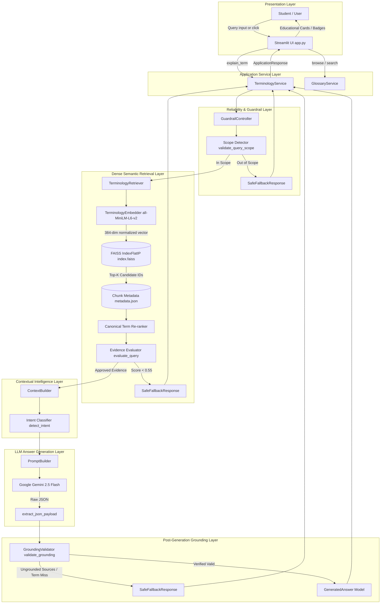
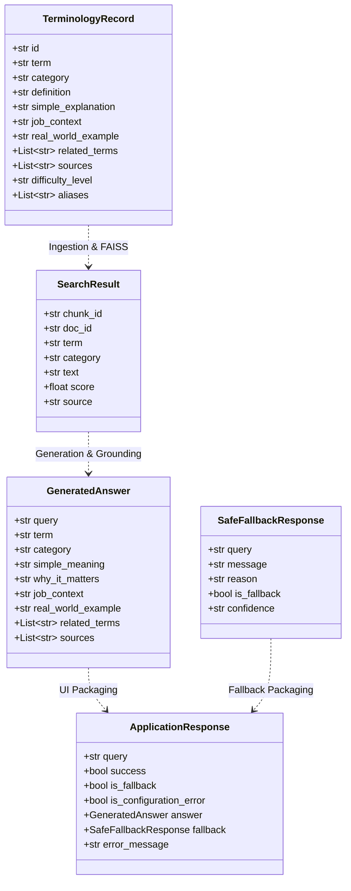
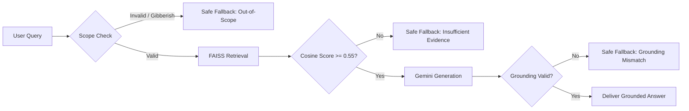

# EMP-12: Job & Skill Terminology Simplifier
## System Architecture & Component Specification

This document provides the definitive architectural design, component responsibilities, data flow, and subsystem interactions of the EMP-12 system.

---

### 1. High-Level Architectural Flow

EMP-12 is organized into decoupled, single-responsibility layers connecting the user interface to retrieval, guardrails, and generation services.



---

### 2. Component Responsibilities

| Subsystem | Module | Key Classes / Functions | Primary Responsibility |
| :--- | :--- | :--- | :--- |
| **Config** | `src/config.py` | `validate_config()`, `sanitize_error_message()` | Global settings, paths, limits (`MAX_QUERY_LENGTH`), and diagnostic redaction. |
| **Ingestion** | `src/ingestion/` | `KnowledgeBaseLoader`, `DocumentProcessor`, `DocumentChunker` | Loads 60 JSON records, validates schemas, and builds 60 normalized single-concept chunks. |
| **Retrieval** | `src/retrieval/` | `TerminologyEmbedder`, `VectorStore`, `TerminologyRetriever` | Embeds text into 384-dim vectors, searches FAISS IndexFlatIP, and applies canonical re-ranking. |
| **Generator** | `src/generator/` | `PromptBuilder`, `TerminologyGenerator`, `extract_json_payload` | Builds grounded prompts and calls Gemini 2.5 Flash to synthesize structured explanations. |
| **Guardrails** | `src/guardrails/` | `GuardrailController`, `validate_query_scope`, `validate_grounding` | Dual-scope gating, 0.55 similarity threshold, evidence sufficiency, and grounding validation. |
| **Context** | `src/context/` | `ContextBuilder`, `detect_intent` | Infers 7 query intents and injects workplace scenarios, difficulty tags, and related terms. |
| **Application** | `src/application/` | `TerminologyService`, `GlossaryService` | Coordinates RAG pipeline, enforces query bounds, and powers the interactive glossary. |
| **UI** | `src/ui/`, `app.py` | `render_difficulty_badge()`, `format_copy_text()` | Streamlit web presentation, cards, quick-start chips, and student study notes export. |
| **Evaluation**| `src/evaluation/` | `TerminologyEvaluator`, `calculate_retrieval_metrics` | Runs automated 92-case benchmark and computes Recall@K, confusion matrix, and latencies. |

---

### 3. Data Flow and State Contracts

Data passes strictly between components through immutable Pydantic models:



---

### 4. Guardrail and Fallback Flow



---

### 5. Deployment Container Architecture

```mermaid
flowchart TD
    subgraph Host_Machine [Host Environment / Docker Engine]
        Port[Host Port: 8501] -->|TCP Forwarding| ContPort[Container Port: 8501]
        EnvVar[Runtime: -e GEMINI_API_KEY] -.->|Injects secret| AppRuntime
    end

    subgraph Container_Filesystem [/app (emp12user)]
        ConfigToml[.streamlit/config.toml] --> AppRuntime[Streamlit Engine]
        AppPy[app.py] --> AppRuntime
        SrcDir[src/] --> AppRuntime
        DataDir[data/knowledge_base/ + processed/] --> AppRuntime
        ModelsDir[models/vector_store/index.faiss] --> AppRuntime
    end

    subgraph Excluded_By_Dockerignore [Protected by .dockerignore]
        EnvFile[.env]
        GitDir[.git/]
        Pycache[__pycache__/]
        TestDir[tests/]
    end
```
